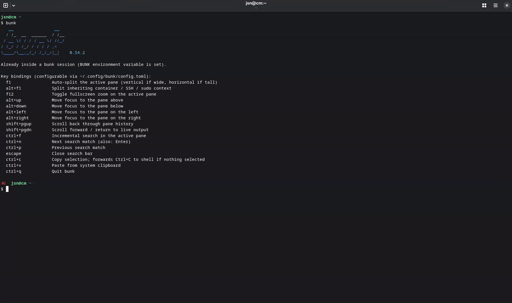

<div align="center">

# bunk

Adds split panes to any terminal. Detects your current context - container, SSH, or sudo - and can open new panes inside the same environment.



</div>

---

bunk is a terminal multiplexer written in Go. Each pane has its own PTY. It's been used daily with Copilot CLI, Claude Code, btop, vim, and other TUI apps.

## Features

- Split panes (F1) - direction chosen by pixel cell aspect ratio, not column count
- Context-aware split (Alt+F1) - opens a new shell in the same container, SSH host, or sudo
- Zoom (F12) - fullscreen toggle for the active pane; other panes stay open
- Content reflow - text rewraps at the new column width on every split or resize
- Per-pane scrollback (10 000 lines by default) with Shift+PgUp/PgDn, preserved through vim and other alt-screen apps
- Incremental search (Ctrl+F) across live output and scrollback
- Copy/paste with Ctrl+C / Ctrl+V (Ctrl+C passes through when no selection is active)
- Mouse: click to focus, drag to select, double-click word, scroll wheel; Shift overrides app mouse mode
- Status badges: container name, SSH host, sudo, scroll depth
- Themes: `terminal` (inherit from host), `default`, `solarized-dark`, `dracula`, `nord`

## Installation

```bash
grm install jsnjack/bunk
```

Or grab a binary from [Releases](https://github.com/jsnjack/bunk/releases).

## Auto-launch

Add to `~/.bashrc` or `~/.zshrc`:

```bash
if [[ -t 1 ]] && [[ -z "$BUNK" ]] && [[ -z "$SSH_TTY" ]] && command -v bunk &>/dev/null; then
    exec bunk
fi
```

`BUNK=1` is set in every pane to prevent recursion.

## Key Bindings

| Key | Action |
|-----|--------|
| `F1` | Split pane (taller than wide → splits top/bottom; wider than tall → splits left/right) |
| `Alt+F1` | Split with a new shell in the same context (SSH / container / sudo) |
| `F12` | Toggle fullscreen zoom |
| `Alt+←↑→↓` | Navigate between panes |
| `Shift+PgUp` / `Shift+PgDn` | Scroll history |
| `Ctrl+F` | Search (Enter / Ctrl+N = next, Ctrl+P = prev, Esc = exit) |
| `Ctrl+C` | Copy selection; passes `^C` through if nothing is selected |
| `Ctrl+V` | Paste |
| `Ctrl+Q` | Quit |
| `Ctrl+D` / `exit` | Close active pane |
| `Alt+R` | Re-initialise host terminal (recovery after binary corruption) |
| Mouse drag | Select text (hold Shift to override app mouse mode) |
| Double-click | Select word |
| Drag to edge | Auto-scroll into history while selecting |

## Context-aware splitting (`Alt+F1`)

`F1` always opens a plain host shell. `Alt+F1` opens a new shell in the same context as the current pane.

Supported contexts: Podman, Docker, LXD/LXC, Incus, Toolbox, Distrobox, SSH, sudo/su.

## Status badges

Shown in the top-right corner of each pane:

| Badge | Meaning |
|---|---|
| `⬡ mycontainer` | Podman / Docker / LXD / LXC / Incus container |
| `▣ my-toolbox` | Toolbox or Distrobox container |
| `⇄ myserver.com` | SSH session |
| `sudo` / `su` | Elevated shell |
| `ZOOM` | Pane is in fullscreen zoom mode (`F12`) |
| `-42` | Scrolled back 42 lines |
| `COPIED` | Selection copied to clipboard |

## Configuration

```bash
bunk config init    # writes ~/.config/bunk/config.toml
```

```toml
# Built-in themes: terminal, default, solarized-dark, dracula, nord
# "terminal" inherits all colours from the host terminal emulator.
theme = "default"

# Per-pane scrollback limit (default: 10 000 lines).
# scrollback = 10000

# Log destination - only written when --debug or --trace is passed.
# log_file = "/tmp/bunk.log"

# Cell aspect ratio (height / width). Controls split direction.
# Default 2.25 suits most monospace fonts.
# cell_aspect = 2.25

[keybindings]
split         = "f1"
split_context = "alt+f1"
zoom          = "f12"
quit          = "ctrl+q"
copy          = "ctrl+c"
paste         = "ctrl+v"
search        = "ctrl+f"

[ui]
# Hex colour overrides ("#RRGGBB"). Empty = use theme default.
active_border   = ""
inactive_border = ""
scrollbar_thumb = ""
scrollbar_track = ""
```

## CLI flags

```
bunk [flags]
bunk config init [--force]

Flags:
  --config string    Config file path (default ~/.config/bunk/config.toml)
  --theme  string    Override theme name
  --debug            Debug logging
  --trace            Trace logging (includes raw PTY bytes)
```

## Debugging

If your shell auto-launches bunk from `.bashrc` / `.zshrc`, use this workflow:

```bash
# 1) Open a terminal that does NOT auto-exec bunk
BUNK=1 gnome-terminal

# 2) From that terminal, run the local binary directly
BUNK= ./bunk

# (or: BUNK= ./bunk --trace for detailed logs of all input/output)
```

Or use the Makefile shortcut — builds the local binary, resets `/tmp/bunk.log`, and opens a new terminal with trace logging in one step:

```bash
make run
```
